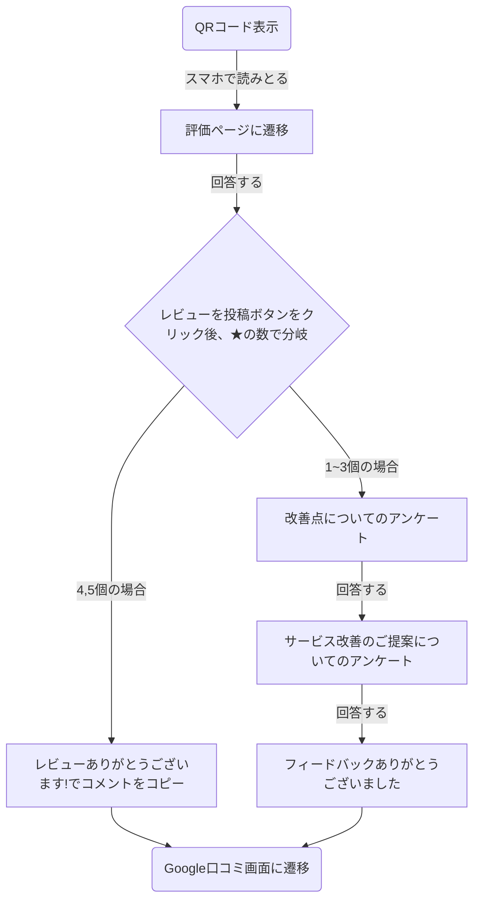
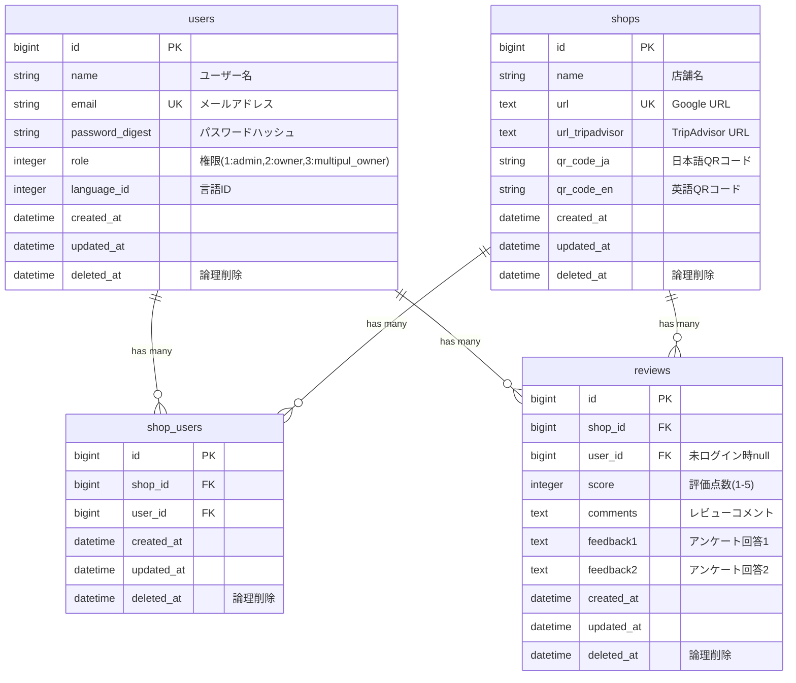
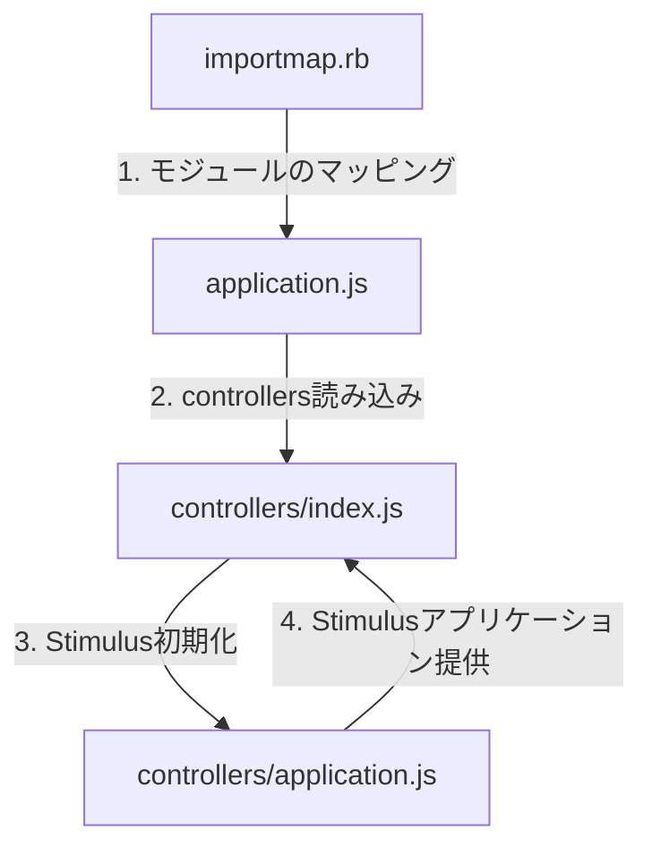

# Viral Verse

## 概要

Viral Verseは、飲食店や小売店などの店舗オーナーが顧客からのフィードバックを効率的に収集し、Google口コミ、TripAdvisor口コミの獲得を促進するWebアプリケーションです。
QRコードを通じて顧客が簡単にレビューを投稿でき、多言語対応により訪日外国人にも対応しています。  
お客さんが書く「レビューの一節」が口コミが拡散していくという意味で、Viral Verseというプロダクト名にしました。

### 簡単な使い方の説明

**ステップ1**  
管理者は、管理画面から各種設定を行います  

  
**ステップ2**  
レビュー者は、QRコードを読み取りアンケート画面へ  

  
**ステップ3**  
レビューが終わり次第、google口コミやTripAdvisor口コミページへと促します  

  
**ステップ4**  
管理者は、口コミを確認して改善に役立てます  


### 主な機能

- **QRコードレビューシステム**: 店舗ごとのQRコードを生成し、顧客がスマートフォンで簡単にレビューを投稿
- **多言語対応**: 日本語、英語、中国語など複数言語でのレビュー入力に対応
- **スマートルーティング**:
  - 高評価（4-5つ星）→ Google口コミへ誘導
  - 低評価（1-3つ星）→ 改善点のアンケートで内部フィードバックとして蓄積
- **権限管理**: 管理者・オーナー・エリアマネージャーごとの細かいアクセス制御
- **レビュー分析**: 蓄積されたフィードバックデータの可視化と分析

## 技術スタック

### バックエンド
- **Ruby on Rails 7.1.5**
- **Ruby 3.2.2**
- **MySQL 8.0**

### フロントエンド
- **Hotwire (Turbo + Stimulus)**
- **Importmap for JavaScript**
- **Tailwind CSS**

### インフラ（本番環境）
- **AWS EC2 (t3.micro)**
- **Nginx + Unicorn**
- **Route 53**
- **S3 (バックアップ)**

### 開発ツール
- **RSpec**: テストフレームワーク
- **RuboCop**: コード品質管理
- **Docker**: 開発環境のコンテナ化

## セットアップ

```bash
# リポジトリをクローン
git clone https://github.com/tomohiko9090/viral-verse.git

# プロジェクトディレクトリに移動
cd viral-verse

# .env.exampleを.envにコピー
cp ./.env.example ./.env

# 依存関係をインストール
bundle install

# データベースをセットアップ
bin/rails db:create
bin/rails db:migrate

# 開発サーバーを起動
bin/rails server
```

## アーキテクチャ

### ユーザーフロー



### データベース設計




### フロントエンド構成



- **app/javascript/application.js**: エントリーポイント
- **app/javascript/controllers/index.js**: Stimulusコントローラーの読み込み
- **config/importmap.rb**: JavaScriptモジュールのマッピング定義

## 権限設計

### ユーザー権限一覧

| ユーザー権限 | 利用者 | アクセス範囲 | ShopsController | ReviewsController |
|-------------|------------|------------|-----------------|-------------------|
| admin       | 開発者・運用者 | すべてのお店 | すべて            | すべて              |
| owner       | オーナー・店長・店員 | 特定のお店   | show, edit, update | すべて              |
| multipul_owner | エリアマネージャー | 特定の複数のお店   | show, edit, update | すべて              |
| customer    | お店に来たお客さん | 特定のお店   | アクセス不可           | new, create, notice |

### 権限別URLアクセス可否一覧表

<details>
<summary>詳細を表示</summary>

#### 凡例
- ✅ - アクセス可能
- ❌ - アクセス不可
- 🔄 - 条件付きアクセス可能（自分の店舗のみなど）

| URL | 画面・機能の説明 | admin | owner | multipul_owner | customer |
|-----|---------------|-------|-------|----------------|----------|
| **セッション関連** |
| GET /login | ログイン画面 | ✅ | ✅ | ✅ | ✅ |
| POST /login | ログイン処理 | ✅ | ✅ | ✅ | ✅ |
| DELETE /logout | ログアウト処理 | ✅ | ✅ | ✅ | ❌ |
| **店舗関連** |
| GET / (root) | トップページ（店舗一覧） | ✅ | ✅ | ✅ | ❌ |
| GET /shops | 店舗一覧画面 | ✅ | ✅ | ✅ | ❌ |
| GET /shops/new | 新規店舗登録画面 | ✅ | ❌ | ❌ | ❌ |
| POST /shops | 店舗登録処理 | ✅ | ❌ | ❌ | ❌ |
| GET /shops/:id | 店舗詳細画面 | ✅ | 🔄 | 🔄 | ❌ |
| GET /shops/:id/edit | 店舗情報編集画面 | ✅ | ❌ | ❌ | ❌ |
| PATCH/PUT /shops/:id | 店舗情報更新処理 | ✅ | ❌ | ❌ | ❌ |
| DELETE /shops/:id | 店舗削除処理 | ✅ | ❌ | ❌ | ❌ |
| **ユーザー関連** |
| GET /shops/:id/users/new | 新規ユーザー登録画面 | ✅ | ❌ | ❌ | ❌ |
| POST /shops/:id/users | ユーザー登録処理 | ✅ | ❌ | ❌ | ❌ |
| GET /shops/:id/users/:user_id/edit | ユーザー情報編集画面 | ✅ | ❌ | ❌ | ❌ |
| PATCH/PUT /shops/:id/users/:user_id | ユーザー情報更新処理 | ✅ | ❌ | ❌ | ❌ |
| DELETE /shops/:id/users/:user_id | ユーザー削除処理 | ✅ | ❌ | ❌ | ❌ |
| **レビュー関連** |
| GET /shops/:id/reviews | レビュー一覧・分析画面 | ✅ | 🔄 | 🔄 | ❌ |
| GET /shops/:id/reviews/new | レビュー入力画面 | ✅ | ✅ | ✅ | ✅ |
| GET /shops/:id/reviews/new/:locale | 多言語レビュー入力画面 | ✅ | ✅ | ✅ | ✅ |
| POST /shops/:id/reviews | レビュー送信処理 | ✅ | ✅ | ✅ | ✅ |
| GET /shops/:id/reviews/:review_id/notice | レビュー完了・お礼画面 | ✅ | ✅ | ✅ | ✅ |
| GET /shops/:id/reviews/:review_id/survey1 | アンケート1画面（低評価時） | ✅ | ✅ | ✅ | ✅ |
| GET /shops/:id/reviews/:review_id/survey2 | アンケート2画面（低評価時） | ✅ | ✅ | ✅ | ✅ |
| POST /shops/:id/reviews/:review_id/submit_survey1 | アンケート1送信処理 | ✅ | ✅ | ✅ | ✅ |
| POST /shops/:id/reviews/:review_id/submit_survey2 | アンケート2送信処理 | ✅ | ✅ | ✅ | ✅ |

#### 権限の詳細

1. **admin（システム管理者）**
   - すべてのURLにアクセス可能
   - 店舗の作成・編集・削除が可能
   - ユーザーの作成・編集・削除が可能
   - すべての店舗のレビューを閲覧可能

2. **owner（通常オーナー）**
   - 自分の店舗の詳細ページのみアクセス可能
   - 自分の店舗のレビュー一覧のみ閲覧可能
   - 店舗の作成・編集・削除は不可
   - ユーザー管理は不可

3. **multipul_owner（複数店舗オーナー）**
   - 自分に紐づく店舗の詳細ページにアクセス可能
   - 自分に紐づく店舗のレビュー一覧を閲覧可能
   - 店舗の作成・編集・削除は不可
   - ユーザー管理は不可

4. **customer（アンケート回答者）**
   - レビュー関連のURLのみアクセス可能
   - ログイン不要のページのみアクセス可能
   - 店舗情報やレビューの閲覧は不可

</details>

## 設計方針

### データモデリング
- **Enum**: ユーザー権限管理
- **ActiveHash**: 言語設定（多言語対応）
- **テーブル管理（縦持ち）**: 業界カテゴリ
- **カラム追加（横持ち）**: 店舗名などの基本情報
- **i18n**: 画面文言の多言語化
- **定数管理**: アプリケーション設定値

## インフラ構成

### AWS アーキテクチャ（コスト別）

<details>
<summary>詳細を表示</summary>

1ヶ月、1日300リクエストの場合を想定

#### 1. 最小コスト構成
**Route 53 → EC2 (t3.micro) [スポットインスタンス] → MySQL(EC2内) → S3**

- **月額コスト**: 約¥900（$6）
- **主な用途**: 開発初期、MVP、小規模運用

**特徴**
- EC2内にMySQLを直接インストール
- スポットインスタンスによるコスト削減
- シンプルな構成で管理が容易

**デメリット**
- DBの冗長性なし
- スポットインスタンスは中断の可能性あり
- スケーリングは手動

#### 2. 標準構成（EC2 + RDS）
**Route 53 → EC2 (t3.micro) → RDS (t3.micro) → S3**

- **月額コスト**: 約¥3,750（$25）
- **主な用途**: 小～中規模のプロダクション環境

**特徴**
- RDSによる堅牢なDB運用
- バックアップ・復元が容易
- 管理が比較的容易

**デメリット**
- コストが中程度
- スケーリングは手動
- 運用管理の工数が必要

#### 3. サーバーレス構成
**Route 53 → API Gateway → Lambda → Aurora Serverless v2 → S3**

- **月額コスト**: 約¥6,150（$41）
- **主な用途**: 変動の大きいワークロード、運用工数を最小化したい場合

**特徴**
- サーバー管理不要
- 自動スケーリング
- 高可用性

**デメリット**
- 最もコストが高い
- 初期構築が複雑
- コールドスタートの問題

#### 選定の指針
1. **開発初期・検証フェーズ**: 最小コスト構成を推奨
2. **本番運用開始時**: 標準構成への移行を検討
3. **スケール時・運用効率化時**: サーバーレス構成への移行を検討

</details>

## デプロイ・運用

### 本番環境デプロイ手順

#### JSやCSSの変更時
```bash
# アセット関連コマンドとUnicornの再起動
RAILS_ENV=production bundle exec rails assets:clean
RAILS_ENV=production bundle exec rails assets:clobber
RAILS_ENV=production bundle exec rails assets:precompile

# Unicorn再起動
kill -QUIT `cat tmp/pids/unicorn.pid` && \
RAILS_ENV=production bundle exec unicorn_rails -c config/unicorn.rb -E production -D
```

#### アプリケーションコードの変更時
```bash
# Unicornの再起動のみ
kill -QUIT `cat tmp/pids/unicorn.pid` && \
RAILS_ENV=production bundle exec unicorn_rails -c config/unicorn.rb -E production -D
```

#### Nginx設定の変更時
```bash
# Nginxの再起動のみ
sudo systemctl restart nginx
```

### ログ確認

```bash
# Unicornのエラーログ
tail -f /var/www/kuchikomi-elevator/log/unicorn.stderr.log

# Unicornの標準出力ログ
tail -f /var/www/kuchikomi-elevator/log/unicorn.stdout.log

# Railsのプロダクションログ
tail -f /var/www/kuchikomi-elevator/log/production.log

# システムログ
sudo tail -f /var/log/messages

# Nginxのエラーログ
sudo tail -f /var/log/nginx/error.log
```

### バックアップ戦略

<details>
<summary>EBSスナップショット自動バックアップ設定</summary>

#### 設定手順

1. **AWSマネジメントコンソールにアクセス**
   - AWSコンソールにサインインし、「EC2」サービスを開く

2. **ライフサイクルマネージャーの設定**
   - EC2ダッシュボードの左メニューから「ライフサイクルマネージャー（Lifecycle Manager）」を選択

3. **ライフサイクルポリシーの作成**
   - 「ポリシーの作成（Create Lifecycle Policy）」ボタンをクリック

4. **ポリシーの設定**
   - ポリシータイプ：EBSスナップショット
   - リソースタイプ：バックアップを取りたいEBSボリュームのタイプ
   - タグ：特定のボリュームだけをバックアップする場合に指定

5. **スケジュールの設定**
   - 頻度：毎日
   - 開始時間：深夜2時など
   - 保持期間：30日分など

6. **ポリシーを有効化**
   - 設定を確認し、「ポリシーを作成」をクリック

</details>

## 今後の展望

- レビューデータのAI分析機能
- 複数店舗の横断分析ダッシュボード
- 自動応答メッセージ機能
- より詳細なユーザー行動分析

## ライセンス

This project is private and not licensed for public use.

## 作成者

[@tomohiko9090](https://github.com/tomohiko9090)
