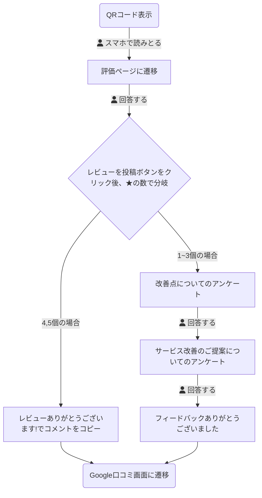
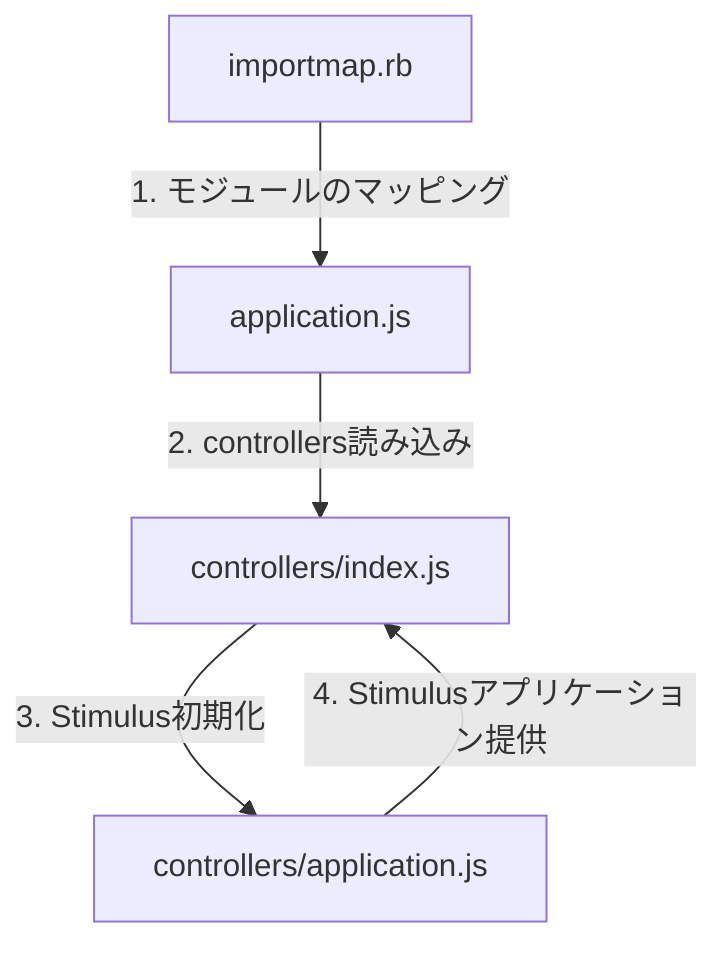

# 暫定デプロイ手順
1. ssh -i ~/.ssh/kuchikomi-elevator.pem ec2-user@57.182.63.187
2. cd /var/www/kuchikomi-elevator
3. git pull origin main
4. 以下実行
```
RAILS_ENV=production bundle exec rails assets:clean
RAILS_ENV=production bundle exec rails assets:clobber
RAILS_ENV=production bundle exec rails assets:precompile
kill -QUIT `cat tmp/pids/unicorn.pid`
RAILS_ENV=production bundle exec unicorn_rails -c config/unicorn.rb -E production -D
```

# ユーザー権限と機能アクセス

| ユーザー権限 | 利用者 | アクセス範囲 | ShopsController | ReviewsController |
|-------------|------------|------------|-----------------|-------------------|
| admin       | 開発者・運用者 | すべてのお店 | すべて            | すべて              |
| owner       | オーナー・店長・店員 | 特定のお店   | show, edit, update | すべて              |
| multipul_owner | エリアマネージャー | 特定の複数のお店   | show, edit, update | すべて              |
| customer    | お店に来たお客さん | 特定のお店   | アクセス不可           | new, create, notice |

# 権限別URLアクセス可否一覧表

## 凡例
- ✅ - アクセス可能
- ❌ - アクセス不可
- 🔄 - 条件付きアクセス可能（自分の店舗のみなど）

## 権限説明
1. **admin**: システム管理者
2. **owner**: 通常オーナー（1店舗のみ）
3. **multipul_owner**: 複数店舗オーナー（複数店舗）
4. **customer**: アンケート回答者

## アクセス権限表

# 権限別URLアクセス可否一覧表

## 凡例
- ✅ - アクセス可能
- ❌ - アクセス不可
- 🔄 - 条件付きアクセス可能（自分の店舗のみなど）

## 権限説明
1. **admin**: システム管理者
2. **owner**: 通常オーナー（1店舗のみ）
3. **multipul_owner**: 複数店舗オーナー（複数店舗）
4. **customer**: アンケート回答者

## アクセス権限表

| URL | 画面・機能の説明 | admin | owner | multipul_owner | customer |
|-----|---------------|-------|-------|----------------|----------|
| **セッション関連** |
| GET /login | ログイン画面 | ✅ | ✅ | ✅ | ✅ |
| POST /login | ログイン処理 | ✅ | ✅ | ✅ | ✅ |
| DELETE /logout | ログアウト処理 | ✅ | ✅ | ✅ | ❌ |
| **店舗関連** |
| GET / (root) | トップページ（店舗一覧） | ✅ | ✅ | ✅ | ❌ |
| GET /shops | 店舗一覧画面 | ✅ | ✅ | ✅ | ❌ |
| GET /shops/new | 新規店舗登録画面 | ✅ | ❌ | ❌ | ❌ |
| POST /shops | 店舗登録処理 | ✅ | ❌ | ❌ | ❌ |
| GET /shops/:id | 店舗詳細画面 | ✅ | 🔄 | 🔄 | ❌ |
| GET /shops/:id/edit | 店舗情報編集画面 | ✅ | ❌ | ❌ | ❌ |
| PATCH/PUT /shops/:id | 店舗情報更新処理 | ✅ | ❌ | ❌ | ❌ |
| DELETE /shops/:id | 店舗削除処理 | ✅ | ❌ | ❌ | ❌ |
| **ユーザー関連** |
| GET /shops/:id/users/new | 新規ユーザー登録画面 | ✅ | ❌ | ❌ | ❌ |
| POST /shops/:id/users | ユーザー登録処理 | ✅ | ❌ | ❌ | ❌ |
| GET /shops/:id/users/:user_id/edit | ユーザー情報編集画面 | ✅ | ❌ | ❌ | ❌ |
| PATCH/PUT /shops/:id/users/:user_id | ユーザー情報更新処理 | ✅ | ❌ | ❌ | ❌ |
| DELETE /shops/:id/users/:user_id | ユーザー削除処理 | ✅ | ❌ | ❌ | ❌ |
| **レビュー関連** |
| GET /shops/:id/reviews | レビュー一覧・分析画面 | ✅ | 🔄 | 🔄 | ❌ |
| GET /shops/:id/reviews/new | レビュー入力画面 | ✅ | ✅ | ✅ | ✅ |
| GET /shops/:id/reviews/new/:locale | 多言語レビュー入力画面 | ✅ | ✅ | ✅ | ✅ |
| POST /shops/:id/reviews | レビュー送信処理 | ✅ | ✅ | ✅ | ✅ |
| GET /shops/:id/reviews/:review_id/notice | レビュー完了・お礼画面 | ✅ | ✅ | ✅ | ✅ |
| GET /shops/:id/reviews/:review_id/survey1 | アンケート1画面（低評価時） | ✅ | ✅ | ✅ | ✅ |
| GET /shops/:id/reviews/:review_id/survey2 | アンケート2画面（低評価時） | ✅ | ✅ | ✅ | ✅ |
| POST /shops/:id/reviews/:review_id/submit_survey1 | アンケート1送信処理 | ✅ | ✅ | ✅ | ✅ |
| POST /shops/:id/reviews/:review_id/submit_survey2 | アンケート2送信処理 | ✅ | ✅ | ✅ | ✅ |

## 補足説明

1. **admin（システム管理者）**
   - すべてのURLにアクセス可能
   - 店舗の作成・編集・削除が可能
   - ユーザーの作成・編集・削除が可能
   - すべての店舗のレビューを閲覧可能

2. **owner（通常オーナー）**
   - 自分の店舗の詳細ページのみアクセス可能
   - 自分の店舗のレビュー一覧のみ閲覧可能
   - 店舗の作成・編集・削除は不可
   - ユーザー管理は不可

3. **multipul_owner（複数店舗オーナー）**
   - 自分に紐づく店舗の詳細ページにアクセス可能
   - 自分に紐づく店舗のレビュー一覧を閲覧可能
   - 店舗の作成・編集・削除は不可
   - ユーザー管理は不可

4. **customer（アンケート回答者）**
   - レビュー関連のURLのみアクセス可能
   - ログイン不要のページのみアクセス可能
   - 店舗情報やレビューの閲覧は不可

## よくある質問

**Q1: オーナーは自分の店舗以外の情報を見ることができますか？**
A1: いいえ、オーナーは自分に紐づいている店舗の情報のみ閲覧できます。

**Q2: レビューページは誰でもアクセスできますか？**
A2: レビューの新規作成や回答ページは誰でもアクセスできますが、レビュー一覧の閲覧にはログインが必要です。

**Q3: 複数店舗オーナーと通常オーナーの違いは何ですか？**
A3: アクセスできる権限は同じですが、複数店舗オーナーは複数の店舗情報にアクセスできます。

**Q4: システム管理者のみができる操作は何ですか？**
A4: 店舗の作成・編集・削除、ユーザーの管理（作成・編集・削除）はシステム管理者のみが可能です。

# DB
https://drawsql.app/teams/--109/diagrams/kuchikomi-elevator-2

# アンケートのフローチャート


# 設計方針
- enum
  - 権限
- アクティブハッシュ
  - 言語設定
- テーブル管理、縦持ち
  - 業界
- カラム追加、横持ち
  - お店名
- i18n
  - いろんなページの文言
- 定数

 
# AWS アーキテクチャ提案（コスト順）
1ヶ月、1日300リクエストの場合を想定

## 1. 最小コスト構成
Route 53 → EC2 (t3.micro) [スポットインスタンス] → MySQL(EC2内) → S3
Copy- **月額コスト：約¥900（$6）**
- **主な用途：開発初期、MVP、小規模運用**
### 特徴
- EC2内にMySQLを直接インストール
- スポットインスタンスによるコスト削減
- シンプルな構成で管理が容易
### デメリット
- DBの冗長性なし
- スポットインスタンスは中断の可能性あり
- スケーリングは手動

→ S3にバックアップを取ることも可能

## 2. 標準構成（EC2 + RDS）
Route 53 → EC2 (t3.micro) → RDS (t3.micro) → S3
Copy- **月額コスト：約¥3,750（$25）**
- **主な用途：小～中規模のプロダクション環境**
### 特徴
- RDSによる堅牢なDB運用
- バックアップ・復元が容易
- 管理が比較的容易
### デメリット
- コストが中程度
- スケーリングは手動
- 運用管理の工数が必要

## 3. サーバーレス構成
Route 53 → API Gateway → Lambda → Aurora Serverless v2 → S3
Copy- **月額コスト：約¥6,150（$41）**
- **主な用途：変動の大きいワークロード、運用工数を最小化したい場合**
### 特徴
- サーバー管理不要
- 自動スケーリング
- 高可用性
### デメリット
- 最もコストが高い
- 初期構築が複雑
- コールドスタートの問題

## 選定の指針
1. **開発初期・検証フェーズ**
   - 最小コスト構成を推奨
   - コストを抑えながら機能検証が可能

2. **本番運用開始時**
   - 標準構成への移行を検討
   - データの永続性と運用の安定性を確保

3. **スケール時・運用効率化時**
   - サーバーレス構成への移行を検討
   - トラフィック変動への対応と運用負荷の軽減

## 注意点
- すべての構成で、AWS無料枠の活用が可能
- トラフィック増加に応じて、上位構成への移行を検討
- セキュリティとバックアップは全構成で考慮が必要


# DBバックアップ戦略
## EBSスナップショットの自動バックアップ設定手順

	1.	AWSマネジメントコンソールにアクセス：
	•	AWSコンソールにサインインし、「EC2」サービスを開きます。
	2.	ライフサイクルマネージャーの設定：
	•	EC2ダッシュボードの左メニューから「ライフサイクルマネージャー（Lifecycle Manager）」を選択します。
	3.	ライフサイクルポリシーの作成：
	•	「ポリシーの作成（Create Lifecycle Policy）」ボタンをクリックします。
	4.	ポリシーの設定：
	•	以下の項目を設定します。
	•	ポリシータイプ：EBSスナップショットを選択します。
	•	リソースタイプ：バックアップを取りたいEBSボリュームのタイプを選びます。
	•	タグ：特定のボリュームだけをバックアップしたい場合、タグを指定してフィルタリングします。
	5.	スケジュールの設定：
	•	「スケジュールの追加」をクリックし、以下の内容を設定します。
	•	頻度：毎日を選択。
	•	開始時間：バックアップを取りたい時間を指定（たとえば毎日深夜2時など）。
	•	保持期間：バックアップを何日分保持するかを指定します（例えば30日分保持など）。
	6.	ポリシーを有効化：
	•	設定を確認し、「ポリシーを作成（Create Policy）」をクリックして完了です。

## 毎日自動でEBSスナップショットを取る手順
	1.	AWSマネジメントコンソールにアクセス：
	•	AWSにサインインし、「EC2」サービスに移動します。
	2.	Data Lifecycle Managerの設定ページにアクセス：
	•	左のメニューで「ライフサイクルマネージャー（Lifecycle Manager）」を選択します。
	3.	ライフサイクルポリシーの作成：
	•	「ポリシーの作成（Create lifecycle policy）」をクリックします。
	4.	ポリシーの設定：
	•	ポリシーの内容を設定していきます。
	•	ポリシータイプ：EBSスナップショットを選択。
	•	リソースタイプ：ボリュームを選択。
	•	タグ指定：特定のボリュームだけバックアップしたい場合は、該当するボリュームのタグを指定します。
	5.	スケジュールの設定：
	•	「スケジュールの追加」をクリックし、スナップショットのスケジュールを設定します。
	•	頻度：毎日を選択。
	•	開始時間：バックアップの実行時間を指定します（例：深夜2時）。
	•	保持期間：スナップショットを何日間保存するか設定します（例：30日）。
	6.	ポリシーの有効化：
	•	設定内容を確認し、「ポリシーを作成」をクリックして完了です。


# 他の開発者がプロジェクトを設定する際の設定
```shell
# リポジトリをクローン
git clone [リポジトリURL]

# プロジェクトディレクトリに移動
cd [プロジェクト名]

# .env.exampleを.envにコピー
cp ./.env.example ./.env

# 依存関係をインストール
bundle install

# データベースをセットアップ
bin/rails db:create
bin/rails db:migrate
```


# ログ
## Unicornのエラーログを確認
tail -f /var/www/kuchikomi-elevator/log/unicorn.stderr.log

## Unicornの標準出力ログを確認
tail -f /var/www/kuchikomi-elevator/log/unicorn.stdout.log

## Railsのプロダクションログを確認
tail -f /var/www/kuchikomi-elevator/log/production.log

## システムログも確認
sudo tail -f /var/log/messages

## Nginxのエラーログ
sudo tail -f /var/log/nginx/error.log

## フロント読み込み
- app/javascript/application.js
  - 起点となるファイル
- app/javascript/controllers/index.js
  - 読み込むファイル
- config/importmap.rb
  - モジュールをどこから読み込むかを定義するファイル
  - pin "application" と書くと、app/javascript/application.jsを読み込めるようになる
- app/javascript/controllers/application.js
	- StimulusのApplicationインスタンスを作成・設定
	- インスタンスを他のファイルで使えるようexport
	- デバッグ設定なども行う




```
<script type="importmap">
にある順番で
curl -k https://57.182.63.187/shops/1/reviews/new
の順番で読み込まれていく
```

- JSやCSSの変更 → アセット関連コマンドとUnicornの再起動
```
RAILS_ENV=production bundle exec rails assets:clean    # 古いアセットを削除
RAILS_ENV=production bundle exec rails assets:clobber  # アセットを完全に削除
RAILS_ENV=production bundle exec rails assets:precompile # アセットを再コンパイル
```
- アプリケーションコードの変更 → Unicornの再起動のみ
	- ex.mainブランチをpullした後やUnicornの設定を大きく変更した時
```
kill -QUIT `cat tmp/pids/unicorn.pid` && \
RAILS_ENV=production bundle exec unicorn_rails -c config/unicron.rb -E production -D
```
- Nginx設定の変更 → Nginxの再起動のみ
	- ex./etc/nginx/conf.d/rails.conf などのNginx設定ファイルを変更した時
```
sudo systemctl restart nginx
```

export DB_USERNAME=root
export DB_PASSWORD=Katasutorohu2@
export PROD_DB_NAME=kuchikomi_elevator_production
export PROD_DB_USERNAME=root
export PROD_DB_PASSWORD='dGjl;6w>aHs%'
export PROD_DB_SOCKET=/var/lib/mysql/mysql.sock
export SECRET_KEY_BASE="eaf7d4fb636a6e8bfd0603c602118fbf06679875344531686319a4c881a26ee89463095fd1f9190f8f2eb08fe9d890e51f2207d07e3fe2379e7d7bc4a8c5694e"
export RAILS_ENV=production
export BUNDLE_GEMFILE=/var/www/kuchikomi-elevator/Gemfile


⌘ + D  ペインを横に分割する
⌘ + Shift + D	 ペインを縦に分割する
